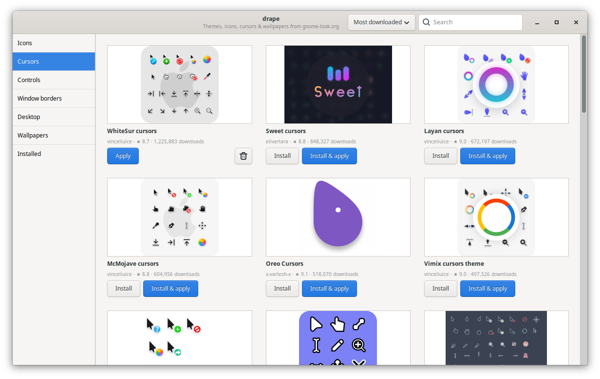

# drape

A theme manager for Linux desktops that treats each part of your look separately. Browse
[GNOME-Look](https://www.gnome-look.org), [KDE-Look](https://www.kde-look.org), and
[Xfce-Look](https://www.xfce-look.org) through their shared Pling catalog by category — **icons,
cursors, controls (GTK), Qt applications (Kvantum), window borders, desktop styles, KDE global themes, color schemes and wallpapers** — and install or apply them in one
click. No hunting for archives, no guessing which folder things go in.



**Website:** https://anolis.github.io/drape/

## What it handles for you

- **Theme packs for your desktop.** Browse downloadable bundles with at least two usable
  appearance parts, plus compatible KDE global themes. The catalog follows the current
  desktop and window manager, including Plasma 5/6. Archive inspection confirms the bundle
  before showing it; unknown downloads stay hidden in this section. Installation checks again
  and skips unsupported components. **Apply pack** lets you choose one variant for each part,
  or keep that part's current theme. Installed bundles also appear under **Theme packs**.
- **Finds what's actually in a download, before you download it.** drape reads each download's
  file list without fetching the whole thing (a zip's table of contents over HTTP range requests,
  or the start of a tar) and shows small glyphs on every card for what's really inside. When an
  item doesn't contain what its tab is for, the card says so in red ("Only pictures inside, not
  Icons"). On install, archives are unpacked (including archives inside archives) and each part is
  detected from its contents, not from the category the uploader picked.
- **Puts things in the right place.** Icons → `~/.local/share/icons`, cursors → `~/.icons`,
  GTK/Cinnamon/Xfwm themes → `~/.themes`, wallpapers → `~/.local/share/backgrounds/drape` (and added to Cinnamon's
  Backgrounds settings when running Cinnamon).
- **Converts Windows cursor packs.** Lots of cursor uploads are Windows `.cur`/`.ani` packs; drape
  converts them to Linux cursors automatically, using the pack's `Install.inf` to map each cursor.
- **Shows variants before you pick.** Packs with Dark / Light / Compact variants get an
  [Apply | ▾] button; ▾ lists the variants with a live preview drawn from each one's own files.
- **Deletes installed items in batches.** Check wallpaper or theme-pack cards in Installed,
  or use Select all in category, then Delete selected. Selection carries across categories;
  one confirmation lists the affected images/packs and flags anything currently in use.
- **Applies them.** Uses Cinnamon, MATE or GNOME settings, or Xfce's Xfconf settings for controls,
  icons, cursors, wallpapers and Xfwm borders. MATE wallpaper settings use filenames, while Cinnamon/GNOME
  use URIs. Packs with several variants (Dark, Compact, …) let you pick which one.
- **Styles the Xfce panel.** An Xfce-only sidebar page controls panel size, length, hiding,
  position locking and GTK theme backgrounds. Bottom taskbar, top bar, bottom dock and left bar
  presets reshape the selected panel while keeping its widgets, with Undo for the last change
  during this app session. Xfwm variants show previews from their own title-bar artwork.
  Wallpaper application covers configured monitors/workspaces, discovers active displays on X11
  even before their wallpaper settings exist, and stops wallpaper cycling.
- **Keeps cursors consistent across apps.** Cursor application updates desktop settings,
  Xcursor defaults, X11 resources and the login environment. Apps such as Kitty can retain
  cursor images until restarted; apps reading launch-time environment settings may need
  one logout/login. Existing profile, Qt and Xft settings are preserved.
- **Themes Qt widget applications.** The **Kvantum themes** catalog offers Qt widget themes
  across desktops, including companions in theme packs. **Qt / Kvantum applications → Kvantum setup** detects
  Qt 5/6 engines, offers repository installation, shows session activation and restores the
  previous Qt appearance from a backup. Log out and back in after first setup; restart Qt
  apps after later theme switches. Menu and autostart commands are left untouched.
  Apps with custom stylesheets or sandboxed runtimes may need their own settings. See
  [Qt setup](docs/qt.md).
- **Makes theme scope clear.** Navigation groups GTK applications, Qt/Kvantum applications,
  desktop shells, window decorations and shared assets separately. Each catalog explains
  what it changes. Modern GNOME Files and Settings use libadwaita's separate appearance;
  selecting a GTK 3 theme or a Kvantum theme does not restyle those apps.
- **Supports KDE Plasma.** Plasma styles, global themes, color schemes and Aurorae window
  decorations install into their native user data folders. Icons, cursors and wallpapers use
  Plasma's apply tools too. Catalog selection follows Plasma 5/6, with KWin detected on X11
  or through D-Bus on Wayland. Global themes apply without requesting a desktop layout reset.
  Native tools must be installed; missing tools disable the corresponding feature. See
  [desktop compatibility](docs/compatibility.md) for category mappings and limitations.
- **Matches the running desktop and window manager.** With **Hide incompatible themes for this desktop** enabled (the default), window borders are scoped to Marco/Metacity, pre-5.4 Muffin, Xfwm or KWin/Aurorae,
  and Cinnamon desktop themes are excluded from other sessions. Known incompatible downloads
  are filtered after archive inspection; incomplete or unrecognized listings stay hidden
  while filtering is enabled. Turn the filter off to browse unverified downloads. GTK controls require a GTK 3 component.
  Mixed archives install usable components, and Apply checks compatibility again. The default
  download selection tries another variant if the first is incompatible; an explicitly chosen
  download is never silently substituted. The sidebar and Installed category tabs always hide unsupported sections and update when the window manager changes.
  Cinnamon 5.4 and newer use Controls (GTK) themes for window borders, so they have no separate Window borders section.
  Turn the filter off to broaden downloads within supported sections, or use CLI `--all-themes`
  to install for another session; this does not enable applying unsupported components.

  Compiz decorators, GNOME Shell themes, arbitrary compiled Qt styles/KWin plugins,
  and non-KWin window borders on Wayland are not supported yet.
  GTK application themes on KDE should be configured in KDE's own settings. Drape does not assume these sessions use
  GNOME settings just because the schemas are installed. Compatibility checks identify formats,
  not whether every theme's CSS or artwork renders correctly.
- **Boot splash, login and lock screens.** Plymouth boot splashes and SDDM / LightDM web greeter
  login themes install and apply in one click (with one password prompt). If a theme is for a
  login screen you don't have, drape offers to install it and to switch to it. Your own wallpaper,
  Controls theme, icons and cursor can be used for the LightDM login screen too, and the
  **Lock & login** page sets up the Cinnamon lock screen's clock and fonts. The compatibility
  filter also limits login themes to installed login managers.
- **Shows your whole look.** Installed → **In use** breaks down everything active right now
  (controls, window borders, desktop, icons, cursors, wallpaper, login screen, boot splash) with a
  preview of each, where it came from, and buttons to change it. It works for themes drape didn't
  install too.
- **Compiz, built in.** The **Window manager** page shows what manages your windows and offers
  Compiz. On Cinnamon it installs Compiz with a small MATE session you pick at the login screen,
  leaving Cinnamon untouched; on MATE and Xfce it switches window managers live. CompizConfig
  Settings Manager runs inside drape, installs show a real progress bar, and removal takes out
  exactly the packages drape added.
- **Explains window borders.** Border themes only reach apps whose title bar the window manager
  draws, so drape says which apps they affect, can open a sample window, and (only if you allow
  it) checks your open windows to show which ones will change.
- **Handles name clashes.** If a new theme shares a name with one you have, drape explains and
  offers **Replace**, even for the boot splash or login theme currently in use (`--replace` on
  the command line).
- **Filters incompatible themes for the current desktop.** The single **☰ → Hide incompatible
  themes for this desktop** option covers all categories and uses the desktop, window manager,
  display manager and known version requirements. Cinnamon checks both older and newer dialog
  styles; mixed bundles keep their usable components. Archive checks run independently of previews.
  Unverified downloads stay hidden with the filter enabled, and are labeled when it is disabled. Installed
  files are preserved when hidden. These checks catch known format/version mismatches, not every
  visual defect in a theme.

- **Shows installation stages.** One progress bar covers downloading, extraction, copying,
  icon-cache generation, cleanup and saving. It names the current step and reaches 100%
  only after installation succeeds. Steps have fixed shares of the bar; the percentage
  describes installation progress, not an estimate of time remaining.
- **Fast on slow connections.** Tabs show cached results instantly and refresh in the
  background, cards load small previews in batches with infinite scroll, and animated previews
  watch their own CPU cost (idle CPU dropped from 21% to 4%). The window fits screens down to
  about 600 px wide.
- **Shows where everything went.** ⋯ → *Show installed files* lists every folder an item
  installed (including system copies), with sizes, file lists and a button to open each one.
- **Cleans up.** Everything is tracked in `~/.local/share/drape/installed.json`, so Remove deletes
  exactly what was installed, and *Check for updates* compares against the Pling catalog.
  Record updates are locked across threads and processes, and file installation/removal is
  serialized while downloads can run together. Each successful update keeps the previous records
  in `installed.json.bak`. Unreadable or malformed records stop updates with an error instead of
  being treated as an empty installation list.
- **Works with the catalogs' own Install buttons** (`ocs://` links) once registered.
- **Safe by default.** Downloads are checksum-verified when the catalog provides a checksum, archive extraction rejects path tricks, and
  drape won't overwrite themes it didn't install without asking.

## Download failures

Catalog and file requests retry HTTP 500, 502, 503 and 504 failures twice. If the server
still fails, Drape reports the failure. You can also install an archive from the author
with `drape install-file /path/to/theme.zip`; external installation scripts are not run.

## Root access

Boot splash and login screen changes, and installing or removing Compiz, need root. They go through a small helper
(`drape/helper.py`) run with `pkexec`, so you get the normal password prompt and only those
specific actions run as root. The helper copies files without following links swapped in along
the way, marks everything it installs, and never replaces or removes system themes it didn't
install. Its Plymouth handling is adapted from
[Plymouth Configurator](https://github.com/anolis/plymouth-configurator).

GDM login themes aren't supported: they work by replacing a core GNOME Shell file, which breaks
when GNOME updates.

## Install

Needs Python 3.12+, PyGObject with GTK 3, Pillow and Requests, plus polkit for boot splash and login screen changes. Xfce uses `xfconf-query`; KDE uses its native Plasma apply tools. Qt widget themes require a Kvantum plugin for the app's Qt major version; **Qt / Kvantum applications → Kvantum setup** detects Qt 5/6 engines and offers installation from configured Arch or Debian/Ubuntu repositories.

If dependencies are missing, Drape offers to install them on Arch-based distributions (including CachyOS) and Debian/Ubuntu-based distributions. Terminal launches use a y/n prompt and `sudo`; menu launches use a dialog and `pkexec`. If GTK's Python bindings are missing, the dialog uses KDialog or Zenity when available. Installation only runs after you accept, and Drape resumes after a successful installation.

On a fresh CachyOS live session, pacman's repository databases may be absent. Drape detects this before installation and asks permission to refresh them and perform a full system upgrade along with the dependency install. Existing databases are used without a refresh for ordinary installs.

To install dependencies manually on CachyOS or Arch, refreshing the repositories and upgrading the system at the same time:

```sh
sudo pacman -Syu --needed python-pillow python-gobject gtk3 python-requests
```

```sh
./install.sh            # per-user, no root; adds a menu entry and the ocs:// handler
./install.sh --uninstall
```

Or run it in place: `./bin/drape`.

### Updating

Drape checks for app updates once a day and offers **Update and restart**. Use **Check for Drape updates** in the ☰ menu to check immediately, or turn off automatic checks there. This updates official Git clones on `main` tracking `origin/main`; local edits, untracked files and local commits block the update so your work is preserved. Network failures during automatic checks do not interrupt startup.

To update older installs manually, close Drape and run these commands from your clone:

```sh
git pull --ff-only
./install.sh
./bin/drape
```

Installed themes and preferences stay in place. Save or commit local changes if Git refuses the update.

## Command line

```sh
drape search icons papirus           # kinds: icons cursors gtk wm desktop lookandfeel colors wallpapers login boot
drape search colors arc              # KDE color schemes
drape search lookandfeel             # global themes for your Plasma version
drape show 1166289                   # details and download variants
drape install 1166289 --apply        # --file N picks a variant
drape install 1166289 --replace      # replace an installed item whose theme names clash
drape install-url 'ocs://install?url=…'
drape list
drape apply <id> [variant-name]
drape remove <id>
drape updates
```

## License

GPL-3.0. Themes and wallpapers belong to their creators; drape is not affiliated with Pling,
GNOME-Look, KDE-Look or Xfce-Look.

## Development

Python source and tests use four-space indentation, 100-column formatting and blank lines
between logical sections. Section comments explain module responsibilities and non-obvious
compatibility, threading and file-ownership decisions. Keep these consistent with:

```sh
ruff format drape tests bin/drape
ruff format --check drape tests bin/drape
```

Ruff is a development tool; it is not needed to run Drape. Formatting settings live in
`pyproject.toml`.

The website changelog lives in `docs/changelog.html`. Add daily highlights to
`docs/changelog-highlights.json`, then run `python3 tools/update_changelog.py` from a
full checkout to rebuild it with every commit in the current branch's history.

Archive compatibility inspection runs separately from the GUI. See the
[worker guide](docs/compatibility-worker.md) for local index generation, portable snapshots
and explicit imports. Browsing uses existing evidence and leaves unknown themes visible.

The GUI entry point is `drape/app.py`; its implementation is in `drape/ui/`:

- `application.py`: GTK lifecycle and incoming OCS links.
- `window.py`: window layout, navigation, preferences and page coordination.
- `browse.py`, `installed.py`, `active.py`, `details.py`: catalog browsing,
  installed packs, the current look and item details.
- `widgets.py`: shared cards' controls, variant picker and border explanation.
- `images.py`: preview downloads, caches, worker pools and animation state.
- `install_progress.py`: installation stages and coalesced progress-bar updates.
- `card_transitions.py`: card fades, deferred removal and animated compatibility filtering.
- `packs.py`: per-part variant selection and applying downloaded theme bundles.
- `theme_actions.py`, `system_actions.py`: window action mixins for theme operations
  and privileged/login/lock-screen changes. They use the window's state and callbacks;
  pages receive that window explicitly rather than importing it.
- `common.py`, `gtk.py`: shared metadata/helpers and GTK version configuration.

`drape/records.py` owns locked manifest transactions, atomic writes and the previous-version
backup. Use `ManifestStore.edit()` for record mutations so they merge with the latest saved data.

UI modules call the existing `installer`, `pling`, `desktop`, `kde`, `xfce` and
`system` backends. Backends do not import the GUI entry point. Import UI helpers from
their owning module when extending the interface or patching them in tests.

```sh
python3 -m unittest -v
```
